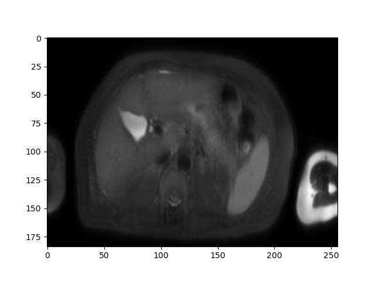
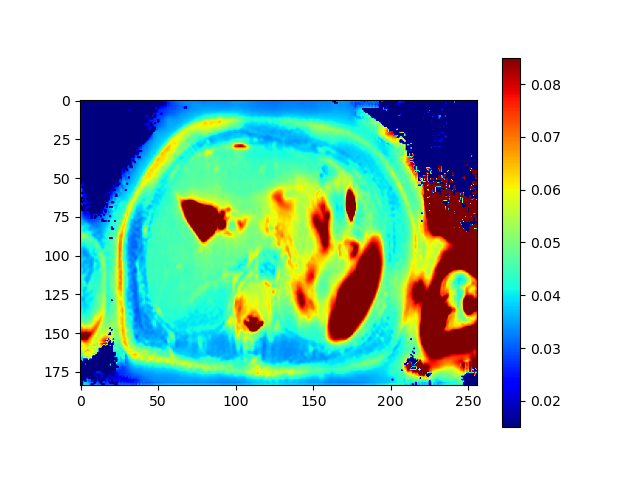

# demo_self-supervised_T1rho_mapping
Demo for the MIDL 2022 (International Conference on Medical Image with Deep Learning) paper:  ***Breathing Freely: Self-supervised Liver T1rho Mapping from A Single T1rho-weighted Image***   
  
Download the model [here](https://drive.google.com/drive/folders/1LN5iQa80_mcDQeTmcZQdU0sRbqXQVYkm)  

Simply run thr demo.py script. This is what you will get:  

|
